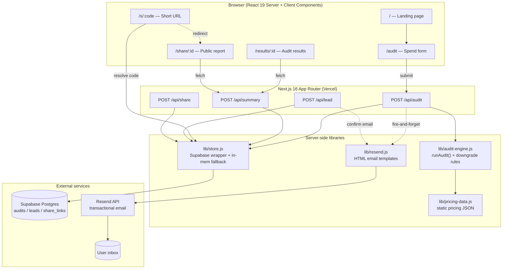

# Architecture

This document explains how Veridex is put together, how data moves through it, why the stack was chosen, and what would need to change to handle 10,000 audits/day.

---

## 1. System Diagram

---

## 2. Data Flow — From Input to Audit Result

A single audit submission walks through six distinct stages. Each stage has a clear contract with the next, which keeps the engine testable and the API route thin.

### Stage 1 — Collection (client)
The user fills `SpendForm` on `/audit`:
- Per-tool entries: `{ tool, plan, seats, monthlyCost }`
- Team metadata: `teamSize`, `useCase`, `orgName`, `orgSize`, `email`

The form runs client-side validation only (required fields, numeric ranges). No business logic lives here — the client is intentionally dumb about *what* a "good" plan looks like.

### Stage 2 — Submit
The form POSTs to `/api/audit` as JSON. This is a Next.js Route Handler (`app/api/audit/route.js`), running on the server (Node runtime on Vercel).

### Stage 3 — Compute
`runAudit(entries, teamSize, useCase)` in `lib/audit-engine.js` does the actual reasoning:

1. For each entry, look up the tool in `PLAN_THRESHOLDS` (pricing-data.js).
2. Apply downgrade rules — e.g. *Cursor Ultra → Pro if team ≤ 50*, *Copilot Enterprise → Business if no SSO requirement*.
3. Compute `recommendedCost` = recommended plan × seats.
4. Compute `monthlySavings` = `actualCost − recommendedCost` (clamped at 0).
5. Aggregate across tools: `totalCurrentSpend`, `totalMonthlySavings`, `totalAnnualSavings`, `percentReduction`, per-tool `breakdown[]`.

The engine is **pure** — no I/O, no DB, no fetch. Given the same input it always returns the same output. This is deliberate (see Decisions section in README).

### Stage 4 — Persist
The route handler:
1. Generates a UUID via `crypto.randomUUID()`.
2. Calls `saveAudit(id, { ...results, input, orgName, orgEmail, orgSize })` → `audits` table.
3. If `email` was provided, calls `saveLead({ auditId, email, companyName, teamSize, source: "audit" })` → `leads` table.

The `audits` and `leads` rows are linked by `auditId`. If Supabase env vars are missing (local dev), `lib/store.js` silently writes to an in-memory Map instead.

### Stage 5 — Side effects (fire-and-forget)
If an email was captured, the route handler kicks off a **non-blocking** chain:
1. `createShareLink(id)` → inserts a row in `share_links` with a fresh 7-char base62 code, returns the code.
2. `sendAuditReportEmail({ to, shareUrl, savings... })` → POSTs to Resend with the rendered HTML template.

This entire chain runs `.then()`-style off the main response. Errors are logged but never block the response. The user sees their results immediately; the email arrives seconds later.

### Stage 6 — Respond
The route returns `{ id, ...results, summary }`. The client navigates to `/results/{id}`, which fetches the same record via `/api/summary` for SSR-friendly rendering. The shared link `/s/{code}` is a thin redirect that resolves the shortcode to an `id` and forwards to `/share/{id}` — same data, public framing.

---

## 3. Why This Stack

Each choice was made against concrete alternatives. Here's the reasoning, not just the bill of materials.

### Next.js 16 (App Router) over a SPA + separate API
A marketing-style landing page + a form + a shareable report has two needs that pull in opposite directions: **SEO-friendly static rendering** for the landing/share pages, and **dynamic server logic** for the audit submission. App Router gives me both in one project — Server Components handle the marketing pages at near-zero cost, Route Handlers cover the API surface, and I never have to maintain a separate Express service or a Vite + Lambda split. React 19 + the React Compiler also means I write less `useMemo`/`useCallback` boilerplate, which keeps the form code readable.

### Tailwind v4 over CSS Modules or a component library
The product needs a custom visual identity (this isn't an internal dashboard), so a component library like MUI/Chakra would fight me more than help. Tailwind v4 ships with zero-config PostCSS, modern CSS features (cascade layers, container queries), and lets me iterate on layout without naming things. The trade-off — class-name verbosity — is acceptable for a project this size, and class duplication never became painful enough to extract components.

### Framer Motion + GSAP for animation
Two libraries because they're good at different jobs. Framer Motion is the right tool for **declarative React-state-driven** transitions (page enters, accordion expand, button hover). GSAP is the right tool for **timeline-based scroll choreography** (the hero scroll-pin, staggered reveals on landing sections). Picking just one would have forced awkward code in whichever domain it was weaker at. Bundle cost is real but tolerable for a marketing-driven page; I could lazy-load GSAP if it ever mattered.

### Supabase (Postgres) over Firebase / PlanetScale / SQLite
I needed:
- Relational data (`audits` ↔ `leads` ↔ `share_links`)
- A free tier that survives a launch
- Server-side writes with a single key, no client SDK gymnastics

Firebase's document model would make the join between leads and audits awkward. PlanetScale dropped its free tier. SQLite on the Vercel filesystem doesn't survive deploys. Supabase gives me real Postgres, generous free tier, RLS available if I ever expose client-side reads, and a hosted dashboard for inspecting rows without writing admin tooling. The downside — vendor lock-in to their auth/realtime add-ons — I'm not using, so it's not a downside in practice.

### Resend over SendGrid / SES / Postmark
Resend's API is one HTTP call, the docs are short, and the free tier (3k emails/month) covers the entire MVP runway. SES is cheaper at volume but requires SNS-based bounce handling and DKIM setup that I'd otherwise be wiring up by hand. SendGrid's API surface is larger than I need. Postmark would have been a fine alternative — Resend won on developer ergonomics. Switching providers later is a 50-line change isolated to `lib/resend.js`.

### Vercel for hosting
Next.js 16's edge/server runtime split is fully supported on Vercel with zero config, preview deployments per PR are free, and the analytics dashboard is enough for early decisions. Self-hosting on a VPS would mean managing Node updates, TLS rotation, and zero-downtime deploys — not worth the time at this stage. If costs become an issue at scale, Next.js runs anywhere Node runs, so the door isn't locked.

---

## 4. Scaling to 10,000 Audits/Day

10k audits/day ≈ **7 audits/minute** sustained, with peaks probably 3–5× that during business hours (~35/min, or one every ~1.7s). The current architecture would *technically* survive this, but several seams would crack first. Here's what I would change, ordered by where the actual pain would hit first.

### 4.1 Move email out of the request path entirely — into a queue

**Current:** Email send is fire-and-forget via `.then()` inside the route handler. The serverless function instance is kept alive long enough to finish, but if Resend has a slow minute, function duration spikes and Vercel starts billing for compute that's just waiting on I/O. Worse, if the function gets recycled mid-flight, the email is lost silently.

**Change:** Push `{ auditId, email }` onto a queue (Upstash QStash, or a Supabase row + cron consumer, or AWS SQS if already on AWS) and acknowledge the API request as soon as the audit is persisted. A separate worker pulls from the queue and calls Resend, with retries on failure and a dead-letter table for permanent failures.

**Why this first:** It cuts API p95 latency, removes the most fragile failure mode (silent email drops), and gives me observability — I can count failed sends instead of grepping logs.

### 4.2 Add real rate limiting and bot protection

**Current:** `/api/lead` has an in-memory rate limit (3/min per IP) and a honeypot. In-memory means *per serverless instance*, which is meaningless once Vercel scales out — each new lambda has a fresh counter.

**Change:**
- Move rate limiting to a shared store. Upstash Redis with a sliding-window counter is the standard play here; `@upstash/ratelimit` is ~5 lines.
- Apply rate limits to `/api/audit` too — at 10k/day, the spam-to-real ratio gets ugly.
- Add Cloudflare Turnstile or hCaptcha on the audit form for invisible bot challenges. The form is high-value spam bait (free email send + DB write per submission).

### 4.3 Database hardening

**Current:** Supabase free tier, no explicit indexes beyond primary keys, service-role key used for all writes from a single Node runtime.

**Change:**
- Move to Supabase Pro (or self-hosted Postgres with PgBouncer in front). Free tier connection limits will be the first thing to break.
- Add indexes on `share_links.short_code` (lookups are the hot read path), `leads.email` (dedup queries), `audits.created_at` (analytics).
- Introduce **connection pooling** via Supabase's transaction-mode pooler — serverless + long-lived TCP doesn't mix, and at 35 req/min peak you'll exhaust connections quickly without it.
- Partition `audits` by month if the table grows past ~10M rows. At 10k/day that's ~3.6M/year, so partitioning becomes relevant after year two — plan for it now, don't execute yet.

### 4.4 Cache the pricing data and the engine output for public share pages

**Current:** Every visit to `/share/{id}` does a DB roundtrip. Every audit recomputes from `pricing-data.js`, which is JS in-process so it's cheap, but the share page is fetched repeatedly (Slack unfurls, link previews, social shares).

**Change:**
- Mark `/share/{id}` and `/s/{code}` as `revalidate = 3600` (or use Next.js `cacheTag`s with on-demand revalidation when an audit is updated). Audit results are immutable after creation, so they cache trivially.
- Put pricing data behind a versioned key (`pricing:2026-05`) and bump the key when prices change — this lets me invalidate cached audits selectively if I ever want to re-run them against new prices.

### 4.5 Observability — you can't fix what you can't see

**Current:** `console.error` and Vercel's default logs. Fine for one developer; useless at 10k/day.

**Change:**
- Structured logging (pino or just JSON `console.log`) with a request ID per audit, propagated to the email worker.
- Sentry (or equivalent) for error tracking, with the audit ID in the breadcrumbs.
- A minimal metrics surface: audits/hour, email-send success rate, share-link click-through, p95 API latency. Vercel Analytics covers some of this; PostHog or a Supabase materialized view would cover the rest.

### 4.6 Split the audit engine into its own module/package

**Current:** `lib/audit-engine.js` is colocated with the Next.js app. Fine today.

**Change:** Extract the engine and pricing data into a separate workspace package (`packages/audit-engine`). Two reasons: (a) it's the most valuable piece of IP in the codebase, and at scale it's worth versioning and snapshot-testing independently from the web app; (b) it unlocks a future B2B API offering — "POST your spend, get an audit JSON back" — without forcing customers through the marketing site.

### 4.7 Things I would *not* change yet, even at 10k/day

- **Stay on Vercel.** 10k requests/day is well within their Pro tier. Self-hosting becomes interesting at ~1M req/day, not here.
- **Stay on Postgres.** No part of this workload needs a NoSQL store. The relational model is the right model.
- **Don't add Redis as a primary store.** It's a tempting move at scale; it's the wrong move here. Use it for rate limits and caching only.
- **Don't introduce GraphQL or tRPC.** Four REST endpoints with hand-written contracts are fine. The complexity tax of a typed RPC layer outweighs the win until there are 20+ endpoints and multiple clients.

The summary: at 10k/day the architecture doesn't need to be *rebuilt*, it needs to be *hardened* — queue out the slow path, share rate-limit state, index the database, cache the immutable reads, and instrument everything.
