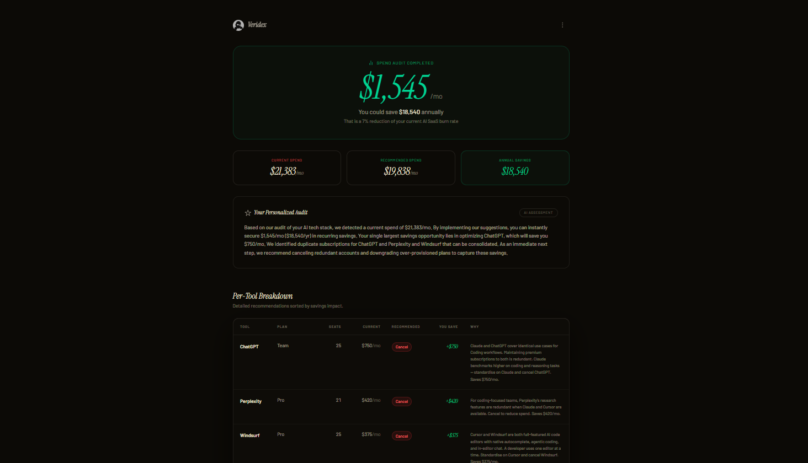
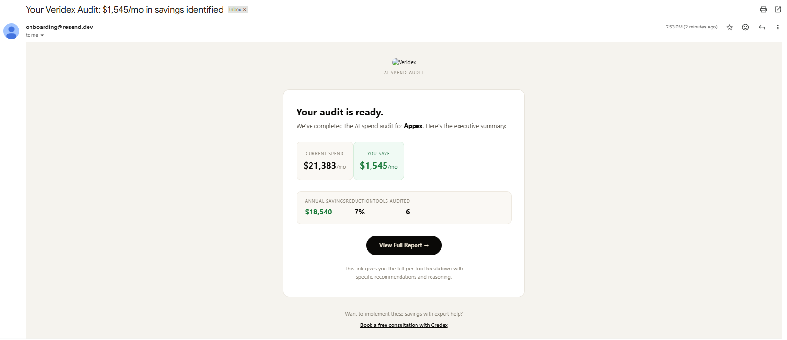

# Veridex — AI Spend Audit

> Find out how much your team is overspending on AI tools — in 60 seconds.

## 1. What this is

Veridex is a self-serve audit tool that analyzes a team's AI subscription spend (Cursor, GitHub Copilot, Claude, ChatGPT, Gemini, Perplexity, and more) and recommends cheaper plans based on actual team size and usage. It produces a personalized savings report, emails it to the user, and generates a shareable short link. Built for engineering managers, founders, and finance leads at small-to-mid-size teams (5–200 seats) who have accumulated AI tool sprawl and want a quick, unbiased second opinion before their next renewal.

**Deployed URL:** [https://veridex-destinydriver.vercel.app/](https://veridex-destinydriver.vercel.app/)

---

## 2. Screenshots & Demo

|                           |                                   |
| ------------------------- | --------------------------------- |
| Landing page              |  |
| Audit form                |  |
| Results & recommendations |  |
| Email report              |  |

**Video walkthrough:**

<p align="center">
  <a href="https://www.youtube.com/watch?v=Wp8SJNqnVRk">
    
  </a>
</p>

<p align="center">
  <a href="https://www.youtube.com/watch?v=Wp8SJNqnVRk">
    ▶ Watch the full walkthrough
  </a>
</p>

---

<iframe 
  width="100%" 
  height="500" 
  src="https://www.youtube.com/embed/Wp8SJNqnVRk?autoplay=1&mute=1" 
  title="YouTube video player" 
  frameborder="0" 
  allow="accelerometer; autoplay; clipboard-write; encrypted-media; gyroscope; picture-in-picture; web-share" 
  allowfullscreen>
</iframe>

---

## 3. Quick Start

### Prerequisites

- Node.js 20+
- A [Supabase](https://supabase.com) project (free tier is fine)
- A [Resend](https://resend.com) account for transactional email

### Install

```bash
git clone <repo-url>
cd credex_assignment
npm install
```

### Configure environment

Copy `.env.example` → `.env.local` and fill in:

```env
NEXT_PUBLIC_SUPABASE_URL=https://<your-project>.supabase.co
SUPABASE_SERVICE_ROLE_KEY=<service-role-key>
RESEND_API_KEY=<resend-api-key>
RESEND_FROM_EMAIL=reports@yourdomain.com
OPENAI_API_KEY=your-openai-api-key
```

### Run locally

```bash
npm run dev      # http://localhost:3000
npm run build    # production build
npm start        # serve production build
npm run lint     # eslint
```

### Deploy

Optimized for Vercel:

1. Push to GitHub.
2. Import the repo in Vercel.
3. Add the four env vars from `.env.local` to **Project Settings → Environment Variables**.
4. Deploy. No build configuration changes needed — `next.config.mjs` is already set up (React Compiler enabled).

For other platforms (Netlify, Render, Fly): any Node 20+ host that supports Next.js App Router will work. Set the same env vars.

---

## 4. Decisions

Five trade-offs I consciously made, and the reasoning behind each.

### 1. Hard-coded pricing data instead of a live pricing API

**Choice:** AI tool pricing (Cursor, Copilot, Claude, etc.) lives in `lib/pricing-data.js` as a static JSON-like object, updated manually.

**Why:** None of these vendors expose a stable public pricing API, and scraping their marketing pages is brittle and legally grey. A live source would mean unreliable data and constant breakage. By baking pricing in, I get deterministic audits and reproducible results — the audit a user sees today is the same audit they can re-run tomorrow. The cost is a manual update cadence (a dated comment in the file makes that obvious), but pricing changes for these tools happen on the order of weeks to months, not hours. Correctness > freshness here.

### 2. Supabase + Postgres over a simpler key-value store (or no DB at all)

**Choice:** Three relational tables — `audits`, `leads`, `share_links` — in Supabase Postgres, with an in-memory fallback for local dev when env vars are missing.

**Why:** I needed persistence for three different shapes of data (audit results, lead capture, short URL mappings) with referential relationships. A KV store like Upstash would have worked for the short links, but I'd have ended up reinventing joins for the lead → audit relationship. Supabase gives me Postgres, a free tier large enough for this stage, a service-role key for trivial server-side writes, and zero ops. The in-memory fallback was deliberate — it keeps the dev experience frictionless for anyone cloning the repo without provisioning Supabase first, at the cost of a bit of branching in `lib/store.js`. Worth it.

### 3. Server-side audit engine, not client-side

**Choice:** `runAudit()` runs inside the `POST /api/audit` route handler, not in the browser.

**Why:** I considered running the audit purely on the client — the math is simple and it would avoid a network round-trip. But three things pushed me server-side: (a) I want every audit persisted so users can revisit results and share links; (b) emailing the report requires server access to the Resend API key; (c) keeping the downgrade rules and pricing logic server-side means I can update them without shipping a new client bundle, and prevents users from inspecting the full rule set in DevTools and gaming it. The latency cost is one round-trip on submit — negligible compared to the email send.

### 4. Short URL shortcodes instead of exposing UUIDs

**Choice:** Audit IDs are UUIDs internally, but shared links use a separate 7-character shortcode (`/s/{code}` → redirects to `/share/{id}`).

**Why:** UUIDs in URLs are ugly, unmemorable, and signal "internal database key" — bad for something a user is meant to copy into Slack or a Twitter post. A 7-char base62 code gives ~3.5 trillion combinations, which is more than enough headroom for this scale, and decouples the public-facing link from the internal record ID. It also gives me a natural place to add per-link analytics later (clicks, expiry) without touching the audit table. The trade-off is one extra table and one extra lookup hop on resolve — both cheap.

### 5. Resend + HTML email templates over a fancier email pipeline

**Choice:** Transactional email goes through Resend with HTML templates defined inline in `lib/resend.js`. No MJML, no React Email, no template service.

**Why:** I send exactly two emails — audit report and consultation confirmation. Pulling in React Email or MJML would add a build dependency and a mental-model tax for two templates that are essentially "branded heading + summary + CTA button." Resend's API is one POST, deliverability is handled, and inline HTML keeps the templates colocated with the code that sends them — easy to find, easy to change. If this grew to 10+ email types or needed marketing-team editing, I'd move to React Email. For now, inline HTML is the right level of investment.

---

## 5. Deployed URL

🔗 [https://veridex-destinydriver.vercel.app/](https://veridex-destinydriver.vercel.app/)

---

## Tech stack

- **Framework:** Next.js 16 (App Router, React 19, Server Components, React Compiler)
- **Styling:** Tailwind CSS v4
- **Animation:** Framer Motion + GSAP
- **Database:** Supabase (Postgres)
- **Email:** Resend
- **Hosting:** Vercel
